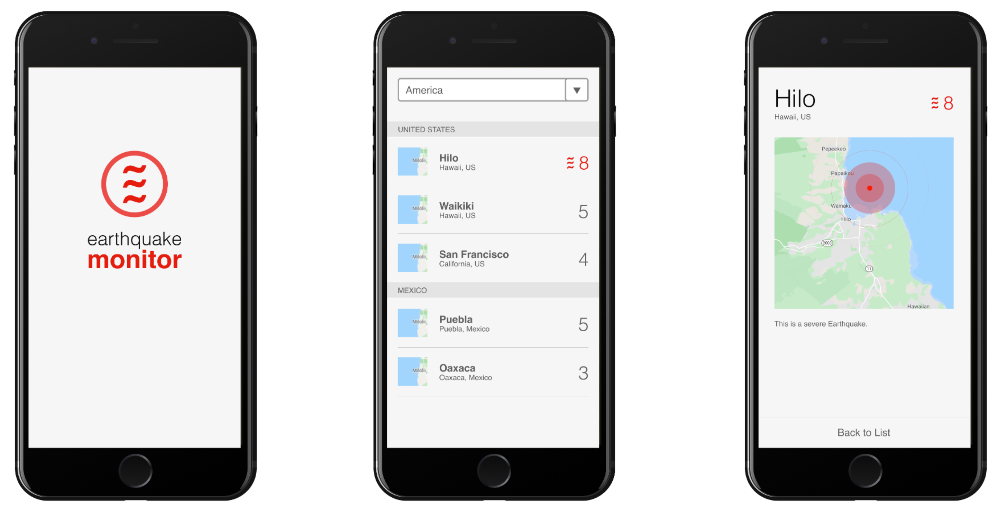

# Earthquake FE

This application acts a Frontend for our [Earthquake API](https://github.com/sdepold/earthquake-api).
In its barebone version, it contains a rough overview page which shows Earthquakes of the last 24 hours for a specific continent.

## Exercise

As a fan of traveling all around the globe, you are a bit worried about earthquakes and would like to check your destinations every once in a while to be on the safe side. For that, you would like to have a mobile web app as displayed above so that you can have a fun travel experience.

## Technical notes

- The desktop browser experience can be neglected. Bonus points if it somehow works.
- You are free to use any additional framework or library you want (the template contains [React](https://react.dev/), [eBay Skin](https://github.com/eBay/ebayui-core-react), [eBay UI Core](https://opensource.ebay.com/skin/) right now)
- Feel encouraged to cover your code with tests
- You can get a list of continents from here:
https://barfooz.net/continents
- You can get earthquake data for a given timeframe from here:
https://barfooz.net/earthquakes?starttime=2024-05-01&endtime=2024-05-02&limit=100
- You can get earthquake details here: https://barfooz.net/earthquakes/ci37650844

## Available Scripts

In the project directory, you can run:

### `npm start`

Runs the app in the development mode.\
Open [http://localhost:3000](http://localhost:3000) to view it in the browser.

The page will reload if you make edits.\
You will also see any lint errors in the console.

### `npm test`

Launches the test runner in the interactive watch mode.\
See the section about [running tests](https://facebook.github.io/create-react-app/docs/running-tests) for more information.

### `npm run build`

Builds the app for production to the `build` folder.\
It correctly bundles React in production mode and optimizes the build for the best performance.

The build is minified and the filenames include the hashes.\
Your app is ready to be deployed!

See the section about [deployment](https://facebook.github.io/create-react-app/docs/deployment) for more information.

### `npm run eject`

**Note: this is a one-way operation. Once you `eject`, you can’t go back!**

If you aren’t satisfied with the build tool and configuration choices, you can `eject` at any time. This command will remove the single build dependency from your project.

Instead, it will copy all the configuration files and the transitive dependencies (webpack, Babel, ESLint, etc) right into your project so you have full control over them. All of the commands except `eject` will still work, but they will point to the copied scripts so you can tweak them. At this point you’re on your own.

You don’t have to ever use `eject`. The curated feature set is suitable for small and middle deployments, and you shouldn’t feel obligated to use this feature. However we understand that this tool wouldn’t be useful if you couldn’t customize it when you are ready for it.

## Learn More

You can learn more in the [Create React App documentation](https://facebook.github.io/create-react-app/docs/getting-started).

To learn React, check out the [React documentation](https://reactjs.org/).

## Potential tasks

- Implementation of earthquake details screen
- Highlighting of severe earthquakes (magnitude >= 8.0)
- Increasing test coverage
- Sorting of earthquakes
- Investigating slowness of the app
- Be creative and come up with your own ideas!
